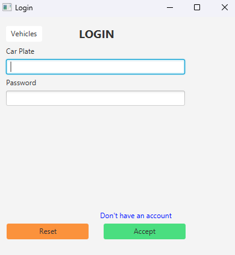

# Interoperability

# Introduction

This project is an application designed to manage vehicles and their associated drivers, leveraging a Spring backend and a JavaFX frontend. It was created to meet the requirements of three distinct courses, resulting in some design choices that, while potentially unconventional or inefficient, serve to demonstrate alternative approaches and solutions.

## Key Features

1. **User Management**: Vehicles can register, log in, and log out of the system.
2. **Driver Association**: Vehicles can create driver profiles and associate them via email.
3. **Driver Management**: Vehicles can view and manage all associated drivers.
4. **Reporting**: Vehicles can create, and manage reports, detailing incidents and damages.
5. **Report Handling**: Vehicles can accept or reject reports made by others regarding their car.
6. **Future Enhancements**: Plans include the integration of an insurance model and expanded roles for drivers.

# **JavaFX Frontend**

The frontend for this project uses JavaFX to interact with several REST endpoints provided by a Spring server. The main controllers consumed by the JavaFX frontend are **`AuthController`**, **`DriversController`**, and **`ReportController`**. This section explains how the REST API is consumed in the frontend, highlights key features, and provides a visual overview of the application.

## **How It Is Consumed**

Each REST endpoint from the REST API that the frontend consumes has its own singleton service for three main reasons:

1. **Shared Functionality:** The **`/drivers`** and **`/reports`** endpoints are protected, leading to some common functions for both.
2. **Controller Reuse:** Each view in the application needs a controller, and some controllers will use the same functions.
3. **Separation of Concerns:** The primary function of the controllers is to connect the views with the backend. In this small application, the controllers also manage view logic, but the backend connection and underlying operations are handled by the services.

Here is an example of how functions in the services are structured:

```java
public enum DriverService {
    INSTANCE;

    private final String BASIC_URL = API_URL + "/driver";
    private final String GET_BY_EMAIL_URL = BASIC_URL + "/byEmail?email=";
    private final String ASSOCIATE_BY_EMAIL_URL = BASIC_URL + "/associate?email=";
    private final String DISASSOCIATE_BY_EMAIL_URL = BASIC_URL + "/disassociate?email=";

    ...

    public DriverDTO getDriverByEmail(String email) throws IllegalAccessException {
        HttpEntity<String> entity = new HttpEntity<>(AuthService.INSTANCE.getAuthHeader());

        RestTemplate restTemplate = new RestTemplate();
        ParameterizedTypeReference<DriverDTO> responseType = new ParameterizedTypeReference<DriverDTO>() {};

        ResponseEntity<DriverDTO> responseEntity = restTemplate.exchange(
                GET_BY_EMAIL_URL + email,
                HttpMethod.GET,
                entity,
                responseType
        );
        return responseEntity.getBody();
    }

    public void createDriverAndAssociate(DriverDTO driver) throws Exception {
        HttpEntity<DriverDTO> requestEntity = new HttpEntity<>(driver, AuthService.INSTANCE.getAuthHeader());

        RestTemplate restTemplate = new RestTemplate();
        ResponseEntity<DriverDTO> response = restTemplate.exchange(
                BASIC_URL,
                HttpMethod.POST,
                requestEntity,
                DriverDTO.class
        );

        if (response.getStatusCode().isError()) {
            throw new Exception("Failed to create: " + response.getBody());
        }
    }

    ...
}
```

All functions follow the same structure:

1. **Prepare the Header and Body:** Create the **`requestEntity`**.
2. **Instantiate the `RestTemplate`:** Set up the **`RestTemplate`** instance.
3. **Make the Request:** Use the **`RestTemplate`** to make an exchange, specifying:
    - The URL
    - The HTTP method
    - The **`requestEntity`**
    - The expected response class
4. **Handle the Response:** Check for errors or return the response body directly.

<aside>
 Since `/drivers` and `/reports` are protected endpoints, the `AuthService` sets the authorization header.

</aside>

## **Key Functions**

One key function, found in the **`AuthService`**, justifies the approach of having services to consume the REST API. This function is **`getAuthHeader`**.

```java
public HttpHeaders getAuthHeader() throws IllegalAccessException {
    HttpHeaders headers = new HttpHeaders();
    String accessToken = TokenService.INSTANCE.getAccessToken();
    headers.set("Authorization", "Bearer " + accessToken);
    headers.setContentType(MediaType.APPLICATION_JSON);
    return headers;
}
```

The logic in **`TokenService.INSTANCE.getAccessToken`** ensures that if any class tries to get an authenticated header without being authenticated, an **`IllegalAccessException`** is thrown. Otherwise, the **`getAuthHeader`** function returns the header.

## Last Version

In a lately version a new section was made. This section basically integrate the `/vehicles` endpoints. The implementation in both backend and frontend folllows the same structure as the previous ones. As this controller does not need authentication for future purposes, the section of vehicles can be access outside login screen. Other thing interesting to know is that this service access the REST API via Mule Flows. This Mule Flows are explained later.

Here are same pictures of how the application looks like:

### **Appearance**




# Mule

In this project, we have two controllers that require full authentication: `DriversController` and `ReportController`. These are crucial for the application's functionality. To simplify the Mule Flows and ActiveMQ implementation, a new controller named `VehiclesController` was created. This section describes the implementation of the Mule flows, how to use them, and what to expect from each flow. Five REST endpoints are implemented:

<aside>
 The path where all files write is in `C:\Users\cserr\OneDrive\CARRERA\3er CURSO\2do CUATRIMESTRE\Interoperability\MuleFiles\insurance`

</aside>

## POST

This endpoint listens for HTTP POST requests to create a new vehicle record.


- **Listener:** Listens on port 8082 at the path `/create` ([http://localhost:8082/create](http://localhost:8082/create)).
- **Set Payload:** Sets the incoming request payload.
- **HTTP Request:** Sends a POST request to `http://localhost:8081/vehicles` with the provided payload.
- **File Write:** Appends the response to `post.txt`. The log entry format is `date + ' -> ' + response`.

<aside>
 All files write with the same structure `date + -> + response`.

```
"2024-05-29T16:13:18.829+02:00 -> {\\n  \\"plate\\": \\"ABCA123\\",\\n  \\"brand\\": \\"Toyota\\",\\n  \\"model\\": \\"Corolla\\",\\n  \\"manufacturingYear\\": \\"2020\\",\\n  \\"id\\": 6,\\n  \\"username\\": \\"ABCA123\\"\\n}"

```

</aside>


## GET By ID

This endpoint listens for HTTP GET requests to retrieve a vehicle record by ID.


- **Listener:** Listens on port 8082 at the path `/` with query parameter `id` (e.g., [http://localhost:8082/?id=2](http://localhost:8082/?id=2)).
- **Set Variable:** Extracts the `id` query parameter.
- **Set Payload:** Sets the payload for the HTTP request.
- **HTTP Request:** Sends a GET request to `http://localhost:8081/vehicles/{id}` using the extracted `id`.
- **File Write:** Appends the response to `getByID.txt`. The log entry format is `date + ' -> ' + response`.


## GET ALL

This endpoint listens for HTTP GET requests to retrieve all vehicle records.


- **Listener:** Listens on port 8082 at the path `/all` ([http://localhost:8082/all](http://localhost:8082/all)).
- **Set Payload:** Sets the payload for the HTTP request.
- **HTTP Request:** Sends a GET request to `http://localhost:8081/vehicles`.
- **File Write:** Appends the response to `getAll.txt`.


## DELETE

This endpoint listens for HTTP DELETE requests to delete a vehicle record by ID.


- **Listener:** Listens on port 8082 at the path `/delete` with query parameter `id` (e.g., [http://localhost:8082/delete?id=5](http://localhost:8082/delete?id=5)).
- **Set Variable:** Extracts the `id` query parameter.
- **Set Payload:** Sets the payload for the HTTP request.
- **HTTP Request:** Sends a DELETE request to `http://localhost:8081/vehicles/{id}`.
- **File Write:** Appends the response to `delete.txt`.


## PUT

This endpoint listens for HTTP PUT requests to update a vehicle record by ID.


- **Listener:** Listens on port 8082 at the path `/update` with query parameter `id` (e.g., [http://localhost:8082/update?id=3](http://localhost:8082/update?id=3)).
- **Set Variable:** Extracts the `id` query parameter.
- **Set Payload:** Sets the payload for the HTTP request.
- **HTTP Request:** Sends a PUT request to `http://localhost:8081/vehicles/{id}` with the updated payload.
- **File Write:** Appends the response to `update.txt`.


# ActiveMQ

In every endpoint of the `VehiclesController`, a message is sent to the ActiveMQ `queue1`. This message is subsequently received by a Mule flow, which logs the message for further processing or monitoring. This approach offers several advantages:

1. **Asynchronous Processing**: By sending messages to a queue, the system decouples the message production from its consumption, enabling asynchronous processing. This improves the responsiveness of the application.
2. **Scalability**: ActiveMQ can handle a high volume of messages and can be scaled horizontally to accommodate increased load.
3. **Reliability**: With ActiveMQ, messages are persisted to disk, ensuring they are not lost even if the system crashes or restarts.
4. **Flexibility**: The Mule flow can be modified to perform various actions such as transforming the message, routing it to different destinations, or triggering additional processes based on the message content.

## Mule Flow

The Mule flow essentially listens for new messages on `queue1` and logs them. Here is a simplified representation:


The Mule flow starts with an "On New Message" component that listens for messages on `queue1`. Once a message is received, it is logged.

## Backend Implementation

In the backend, every endpoint of `/vehicles` invokes the following function to send a message to ActiveMQ:

```java
private void sendMessageToActiveMQ(String message) {
    if (activeMQConfig.isBrokerActive()) {
        jmsTemplate.convertAndSend(
                message
        );
    }
}

```

- **Broker Check**: The method first checks if the ActiveMQ broker is active using `activeMQConfig.isBrokerActive()`.
- **Send Message**: If the broker is active, it sends the message using `jmsTemplate.convertAndSend(message)`.

## ActiveMQ Configuration

Here is the configuration for ActiveMQ:

```java
public class ActiveMQConfig {

    String BROKER_URL = "tcp://localhost:61616";
    String BROKER_USERNAME = "admin";
    String BROKER_PASSWORD = "admin";

    @Bean
    public ActiveMQConnectionFactory connectionFactory(){
        ActiveMQConnectionFactory connectionFactory = new ActiveMQConnectionFactory();
        connectionFactory.setBrokerURL(BROKER_URL);
        connectionFactory.setPassword(BROKER_USERNAME);
        connectionFactory.setUserName(BROKER_PASSWORD);
        return connectionFactory;
    }

    @Bean
    public JmsTemplate jmsTemplate(){
        JmsTemplate template = new JmsTemplate();
        template.setConnectionFactory(connectionFactory());
        template.setDefaultDestinationName("queue1");
        return template;
    }

    @Bean
    public DefaultJmsListenerContainerFactory jmsListenerContainerFactory() {
        DefaultJmsListenerContainerFactory factory = new DefaultJmsListenerContainerFactory();
        factory.setConnectionFactory(connectionFactory());
        factory.setConcurrency("1-1");
        return factory;
    }

    public boolean isBrokerActive() {
        try (Connection connection = connectionFactory().createConnection()) {
            connection.start();
            return true;
        } catch (JMSException e) {
            return false;
        }
    }
}

```

- **Broker Details**: The broker URL, username, and password are specified.
- **Connection Factory**: Creates an `ActiveMQConnectionFactory` bean configured with the broker details.
- **JMS Template**: Configures a `JmsTemplate` bean that uses the connection factory and sets the default destination to `queue1`.
- **Listener Container Factory**: Configures a `DefaultJmsListenerContainerFactory` for managing JMS listeners.
- **Broker Active Check**: The `isBrokerActive` method checks if the broker is active by attempting to create and start a connection.

# jBPM

In this section will be explained the graph made in jBPM for integrating with the REST API. Basically user can set an action (by default is get by id) between get by uid, post, put and delete. Once the action is “selected”, the user insert the neccessary information for each action:

- get → the id
- save → the vehicle
- update → the vehicle and the id
- delete → the id of the vehicle that user wants to delete

The `set the url` script basically initialize the `url` global variable with the URL of the REST API and the id set by the user. The `print result` just print the result pf the REST call and the action of the process.

These are some pictures of the process.


